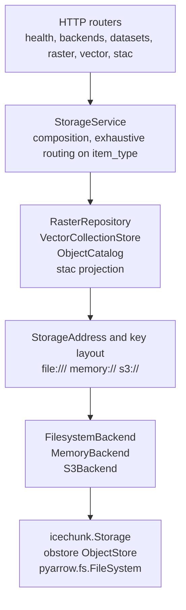

# Architecture

Six layers, and only two of them are protocols. HTTP routers stay thin, the
service layer owns composition, the engines own domain behaviour, addresses and
keys own naming, backends own the three storage handles, and the libraries own
the bytes. A dataset that moves from the filesystem to S3 changes exactly one
layer.

## Layers

Routers parse and validate request parameters and return response models. They
raise no `HTTPException`; a single exception handler maps `StorageError`
subclasses to their `status_code`, so the status code lives with the error that
knows why it happened.

`StorageService` is a frozen dataclass holding the settings, the backend, the
catalogue and the two engines. It is built once in the lifespan and put on
`app.state`. Operations that span item types — deleting a dataset, listing
everything — route with an exhaustive `match` on `item_type`.

The engines are concrete. `RasterRepository` wraps an Icechunk repository;
`VectorCollectionStore` writes and reads versioned GeoParquet;
`ObjectCatalog` stores one JSON record per dataset through obstore. Only
`ObjectCatalog` satisfies a protocol, because a catalogue backed by a database
is a plausible second implementation and a second raster repository is not.

`storage/stac.py` sits beside the engines rather than in the router: it is a
pure projection onto a STAC Collection, with no state of its own. It asks the
engines to describe the version being advertised — one snapshot description for
a coverage, one metadata sidecar and one Parquet footer for a collection — and
takes only identity from the catalog record. Keeping it out of `api/` is what
lets it be tested without a client. See
[the STAC catalog](concepts/stac-catalog.md).

`StorageAddress` and the key module sit between the engines and the backend so
that no engine constructs a path. Every key a backend ever sees came from one
module that validates identifiers and rejects traversal.

Backends resolve one address into three handles. All three are complete: the
filesystem and memory backends, and the S3 backend, which builds the Icechunk
storage, the obstore store and the pyarrow filesystem from one settings block
and is exercised by the whole test suite against rustfs.
[Backends and key layout](concepts/backends-and-layout.md) has the handle table,
the settings-to-client translation, and the S3 key layout.

## Threading

Every storage call is blocking: Icechunk, obstore and pyarrow all do their I/O
in Rust or C, and none of them offers an awaitable. So every route that reaches
the service layer is a plain `def` rather than an `async def`, which is how
FastAPI is told to run it on the anyio threadpool instead of on the event loop.
`GET /health` is the one `async def` left, because it reads a property and
nothing else; it answers while the threadpool is busy, which is what makes it
useful as a probe.

That puts several threads on one `StorageService`, so anything cached on it is
shared. `MemoryStorageBackend` guards its per-address `icechunk.Storage` cache
with a lock, because two threads creating the same repository would otherwise
each keep a store the other cannot see. `S3StorageBackend` builds its `S3Store`
and its `pyarrow.fs.S3FileSystem` once under a lock; both are documented as safe
to share once built, as are Icechunk sessions and obstore stores, so only the
construction needs guarding. `VectorCollectionStore` keeps the etag it last read
for a pointer object in thread-local storage rather than in one dict: a shared
cache would let one thread's publication write against the etag another thread's
read refreshed, which is the lost update the compare-and-swap exists to refuse.

Nothing else on the service holds mutable state. `ObjectCatalog` reads a record
and its revision on every call and remembers nothing, and both engines are
otherwise stateless, so concurrent writers meet each other at the conditional
write rather than in memory.

## Decisions

| Decision | Rationale |
| --- | --- |
| URI addressing, never a bare `Path` | A `Path` cannot represent `s3://bucket/key`. OCS's `artifact_paths.to_absolute` silently rejoins an `s3://` string under the data root. |
| No credentials in addresses or records | A record is written to disk and read by other processes. Credentials stay in settings as `SecretStr`. |
| One backend yields all three handles | Icechunk, obstore and pyarrow must address the same bytes. Building them separately makes a mismatch invisible. |
| obstore for object ops, `pyarrow.fs` for Parquet | There is no obstore-to-pyarrow adapter, and `obstore.fsspec` is best effort. |
| fsspec rejected | Icechunk does its own I/O through Arrow `object_store` and never sees an fsspec filesystem (CLIM-555). |
| Only `StorageBackend` and `Catalog` are protocols | Those are the seams with a real second implementation. Protocols elsewhere would cost exhaustiveness for no gain. |
| `item_type` discriminated union | Replaces 16 scattered `ArtifactFormat.ICECHUNK` comparisons with one exhaustive `match` the type checker enforces. |
| OGC API Features vocabulary | `coverage` and `feature` are already the terms the API surface will use. |
| Publish by pointer move | Branch reset with `from_snapshot_id` and etag-conditional pointer writes are atomic on S3; a directory rename is not (CLIM-880). |
| Rollback is publish with an older target | One code path, tested by the publish tests, with no recovery routine to maintain. See [versioning](concepts/versioning.md). |
| A record makes a dataset exist | No filesystem discovery, so a store without a record is bytes rather than a half-registered dataset. |
| Commit bytes, then write the record | Orphan bytes are found by a prefix listing; a dangling record lists everywhere and fails on open. |
| Blocking routes are plain `def` | FastAPI runs them on the threadpool; an `async def` calling Icechunk would block every other request on the event loop. |
| Guards refuse loudly with thresholds named | A truncated result that looks complete is worse than an error saying what to narrow. |
| `decode_coords="all"` on every read | Without it `spatial_ref` stays a data variable and the CRS is silently lost. |
| Explicit GeoParquet `schema_version="1.1.0"` | Otherwise the file declares 1.0.0 while carrying a 1.1 covering key. |
| Memory backend caches `Storage` per address | `in_memory_storage()` returns a new store per call; caching per instance keeps test isolation. |
| STAC is a projection, not an index | The stores already hold the extents, the variables and the table schema, so a stored catalogue would be a second copy to keep in sync. |
| STAC describes the version, not the record | The record tracks the newest write, so projecting it would advertise a time axis or a row count the published bytes do not have. |
| Only published versions are advertised | An href whose contents change on the next write is worse than an absent collection. `published_only=false` is the operator's view. |

## What the API does not do

No chunk serving and no byte-range proxying. Responses are JSON. Whether a
deployment serves `/zarr` and `/icechunk` for a remote store by presigned
redirect, by proxy, or by pointing clients at `icechunk.http_storage()` is an
open question recorded in [the unified model](research/unified-model.md), and
it is a serving decision rather than a storage one.
