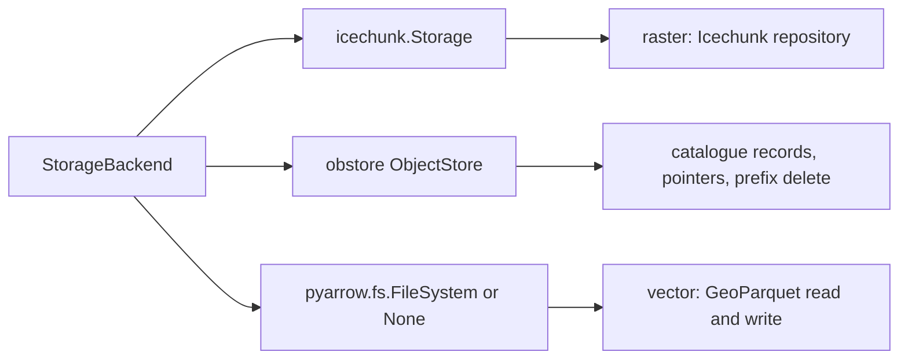

# obstore, fsspec, and pyarrow.fs

Two client libraries, not one. obstore handles raw object operations — catalogue
records, publication pointers, prefix deletes — and `pyarrow.fs` handles
Parquet. There is no adapter between them, and there is no single library that
does both well. One backend class holds both handles and guarantees they are
pointed at the same bytes; that guarantee is the abstraction, not a common
interface.

## Why not fsspec

CLIM-555 rejects an fsspec-mapper abstraction, and the reason is structural
rather than aesthetic. Icechunk does its own I/O through Apache Arrow's
`object_store` crate. It never sees an fsspec filesystem, never sees a
`MutableMapping`, and never sees a Zarr store wrapper. Putting an fsspec mapper
in front of Icechunk does not change where Icechunk reads from — it adds a
layer that the component doing the reading ignores. `docs/project_description.md:185`
in OCS already states this: an alternative backend is a constructor change, not
a path rewrite.

climate-api issue #47 proposed obstore for the object operations that Icechunk
does not cover, and #64 followed it. The proposal holds up.

## obstore 0.11, verified

Stores:

```python
from obstore.store import LocalStore, MemoryStore, S3Store

LocalStore(prefix, mkdir=True)
MemoryStore()
S3Store(
    bucket,
    prefix=...,
    region=...,
    endpoint=...,
    access_key_id=...,
    secret_access_key=...,
    session_token=...,
    skip_signature=...,
    virtual_hosted_style_request=False,
    client_options={"allow_http": True},
)
```

`from_url` builds a store from a URL when that is more convenient. There is no
`from_env` constructor because environment pickup is automatic — credentials in
the usual AWS environment variables are found without being asked for, which is
a difference from Icechunk's explicit `from_env` flag and worth keeping in mind
when a test needs to be sure no ambient credentials are in play.

Operations are module-level functions taking the store as their first argument:
`put`, `get`, `get_range`, `head`, `delete` (which accepts a list of keys),
`copy`, `rename`, `list(store, prefix).collect()`, and
`list_with_delimiter` for directory-style listings. Each has an async twin.

Conditional writes are the reason obstore is worth having:

| Call | Behaviour on conflict |
| --- | --- |
| `put(store, key, data, mode="create")` | raises `AlreadyExistsError` if the key exists |
| `put(store, key, data, mode={"e_tag": etag})` | raises `PreconditionError` if the etag is stale |

Those two give create-if-absent and compare-and-swap on a single object, which
is exactly what a catalogue record and a publication pointer need. They map
onto S3's `If-None-Match` and `If-Match` headers, and they work identically on
`LocalStore` and `MemoryStore`, so the same code path is exercised by the fast
tests.

## What obstore does not do

There is no `pyarrow.fs` adapter. `obstore.fsspec.FsspecStore` exists but is
best effort, and routing Parquet through it to reach `pyarrow` would be two
adapters deep for no gain. GeoParquet therefore uses `pyarrow.fs` directly:
`LocalFileSystem` now, `S3FileSystem` for the S3 backend, and `None` for the
in-memory backend, where the vector path buffers object bytes through obstore
and hands `read_parquet` a `pyarrow.BufferReader` instead.

`zarr.storage.ObjectStore(store)` exists and wraps an obstore store as a Zarr
v3 store. It is not used here: Icechunk owns Zarr I/O, and a second path to the
same bytes would be a second set of semantics to keep consistent. It is worth
knowing about for a future non-Icechunk Zarr dataset.

## Which S3 path Icechunk takes

Icechunk offers both. `s3_storage(...)` uses the native AWS SDK and is the
default, recommended path. `s3_object_store_storage(...)` uses the Arrow
`object_store` crate — the same crate obstore binds — and exists for cases
where the object_store behaviour is specifically wanted. The exploration repo
uses `s3_storage`, which means Icechunk and obstore reach S3 through two
different clients configured from one settings block. That is a real
duplication: two clients, two sets of retry behaviour, two places a credential
can be wrong. It is accepted because the alternative — forcing Icechunk onto
the object_store path to match obstore — trades a well-supported default for
symmetry that no caller can observe.

## The resulting shape



One settings block in, three handles out, all three addressing the same bucket
and prefix. A backend that returned an `icechunk.Storage` for one prefix and an
obstore store for another would be silently broken in a way no type checker
catches, so building all three from one address is the invariant the backend
class exists to hold.
